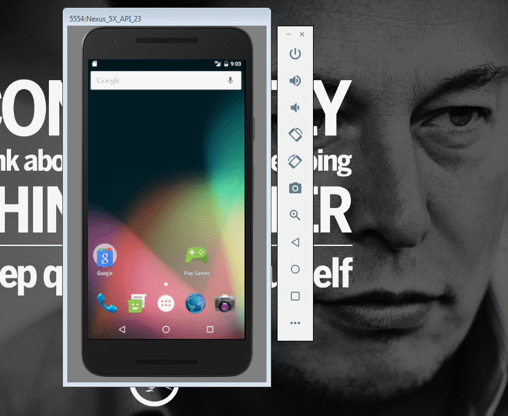

# MyAppPortfolioProject
An small demo app to complete First Project in Udacity Android Developer Nanodegree. See the Tutorial on our cliffnotes for a step-by-step tutorial.

Time spent: 2 hours implementation (included searching) in total
 - 08/17: 2 hours

Implement link: https://github.com/TienVNguyen/MyAppPortfolioProject

Completed these requirements:
 * [x] At least one photo representing the business
 * [x] Business Name
 * [x] Phone number or email address for the business
 * [x] Address of the Business

Notes:

Walkthrough of all functionalities:

